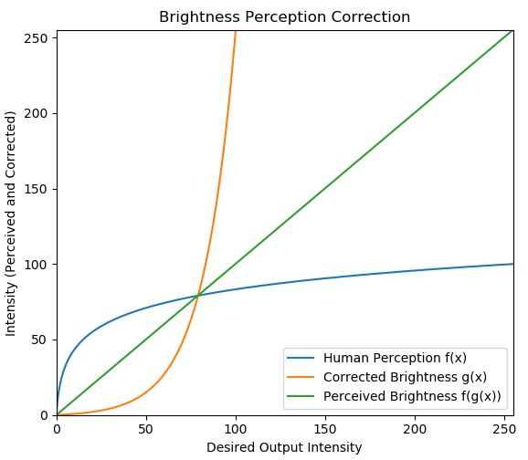
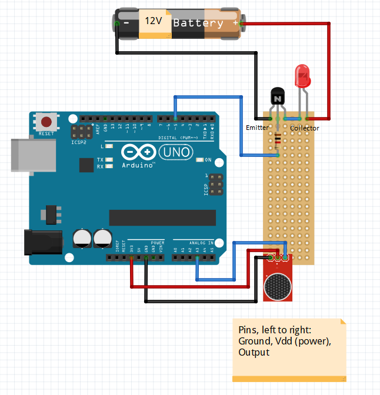

# Overview
An Arduino powered pulse width modulation (PWM) light controller, for making lights flash with music (or any dynamic sound source) in real time. Amplitude driven, no FFT magic here.
Turn any boring old party into a fantastic light show! You’ll be the talk of the neighborhood! Tested on LEDs and 12" cold cathode lamps, the latter of which produce a very interesting effect when hacked to work at less than 100% power. This is a highly technical solution, based primarily on gut feelings, guestimates, and hand waving. Enjoy!

# Recruiters
Hello. Your time is valuable. Here is a short summary of things you might be interested in seeing.

| File | Description  |
|:---:|:---:|
| smoother.cpp |  Custom data structure (specialized cyclical array) |
|  constants.h |  Intuitive, useful usage of inheritance |
|  smoother.cpp  |  Correct pointer usage (new, delete[]) with a destructor  |
| logger.cpp | Custom debug tools |
| All   | Encapsulation, abstraction, and general OOP practices  | 
| All |  Clean, organized, relatively optimized, commented code |
| All | Descriptive CamelCase naming |

Note on optimization: Though embedded, this code is written in a strongly object oriented fashion to prioritize readability and extensibility over performance. The same operation could be realized with fewer function calls and a smaller memory footprint.

# Secret Formula
Powering lights with an Arduino, even making them flash, is trivial. Adjusting brightness in real time, responsively, to music of varying tempo and volume, is not! Three main problems had to be solved: 

| Solution | Purpose |
|---|---|
|Amplitude Normalization|Keep lights responsive at any volume|
|Brightness Perception Correction|Ensure full dimming range|
|Output Smoothing| Keep lights from flashing erratically|

### Amplitude normalization
Music has non-uniform volume at various timescales - seconds, tens of seconds, minutes. And if you don’t take this into account, you’ll likely end up with lights that stay solidly on during loud parts and solidly off during quiet parts – not very exciting! Not to mention, without some form of automatic adjustment, the system wouldn't work without manually presetting a bias<sup>1</sup> to compensate for volume differences in different settings.

To ensure a wide dynamic brightness range, we constantly normalize input volume according to a decaying volume envelope. To illustrate, assume microphone input varies in the range [0, 100]. Suppose that, during quiet parts of a song, only values between 0 and 25 might be measured. Without a correction, the light will never exceed 25% brightness until the song gets louder. So we instantiate a variable maxMicVal = 0, and on every loop, we perform the following test (music_controller.cpp, line 52):

```c++
if (runVars.smoothedMicVal > runVars.maxMicVal)
	runVars.maxMicVal = runVars.smoothedMicVal;
```

Now that we have a value for the current maximum song volume (25), we can linearly map micVal to the range [0, maxMicVal]. The result is a fuller dynamic brightness range, as the quiet part of the song now outputs brightness from 0-100%, instead of just 0-25% without the correction. Now, let's say we've gone from a loud, emotional chorus with maxMicVal == 90, back to a quiet verse with maximum micVal == 25. Without a correction, our current input range of [0, 25] mapped to [0, 90] will output very dim lights, detracting from the performance. There's a catch here: to get an accurate upper volume bound, we have to have some way of predicting the future. Fortunately, the science of watching flashing lights is imprecise, and we can take advantage of a little slop by simply decreasing maxMicVal by a set decay value on every loop:

```c++
runVars.maxMicVal -= constants->minMaxDecay;
```

Tada! Now when a song gets quieter, the output bounds will gradually adjust automatically, while the bounds will be reset as soon as a loud value is measured, and this way we keep the lights in a pretty operating range! You can see this in action if you make a loud noise and watch the lights adjust over a few seconds. There's a tradeoff here between responsiveness (high decay value) and effectiveness (low decay value); a decay that is too quick defeats the purpose of maxMicVal, while a decay that is too slow won't adjust quickly enough for quiet parts. Admittedly, this quick and dirty implementation relies upon a consistent clock rate and makes no attempt to correct for deviations.

The astute reader will observe that there is no correction for the lower volume bound. Based on previous testing, the lights seem to [subjectively] look better this way, although the algorithm has evolved considerably since my initial lower bound implementation, so it might be time for a retest!

### Brightness Perception Correction
A naïve implementation (ask me how I know), adjusting pulse width linearly with mic voltage, causes lights to appear only to flash on and off, with very little dimming in between. I speculate that the human eye perceives light intensity logarithmically<sup>2</sup>, much in the same way that the human ear response (in less technical terms, hearing) is best measured on the logarithmic decibel scale. The solution: map the linear microphone voltage input to an inverse logarithmic function to linearize perception of LED brightness. Essentially what we're doing (warning, math ahead) is composing two functions f(g(x)) (figure below), where  f(x) is is the response of the human eye (hey, that's bright!), and g(x) is the correction curve. 



If our assumptions about perception are correct, and g(x) is close enough to the true inverse of f(x), the result is a mostly linear perception of LED brightness, and a fuller apparent dynamic range. Here's the relevent code from constants.cpp:

```c++
float LEDConstants::Correction(float rawValue)
{	
	return exp(.055452*rawValue) - 1;
}
```

As for the oddly specific value of .055452, in addition to the non-linear correction, this function maps an input range of [0, 100] to [0, 255]. I chose [0,100] as the input range to make adjustments more intuitive to reason about, and the analogWrite function takes a single byte as input to control pulse width from 0 to 255. The result works quite well with the parameters in the code!

###Output Smoothing
The ATMEGA328P microcontroller at the heart of the Arduino Uno runs at 20 Million Instructions Per Second (MIPS). Now, I haven't attempted to calculate the number of instructions this code executes per loop, but if we assume, say, 5000, that means the microphone value is read something like 4000 times per second. These sample times do not necessarily line up meaningfully with the music, and so directly adjusting output PWM on every loop iteration tends to make the lights flash somewhat erratically. The solution here is quite simple: I maintain a cyclical array which is updated on every loop and stores past sample values. On output, I average this array (which empirically works out to a sample window of tens of ms for a length of 150), and the result is that the light intensity tends to change more gradually with time, so that I 'm less likely to be sued for releasing this without a seizure warning. This solution is biased towards the past, and if the array length (or smoothing window width) is too large, this may induce a sort of lag effect, but it doesn't seem to be noticible for array lengths < 150. Alternative solutions could use FFT, or a derivative based calculation, for a less past-biased smoothed output. See smoother.cpp for implementation details, and some fancy pointer-fu. 

Note: this may only be a problem because I adjust output PWM periodically on the order of tens of ms, a relic from legacy code. I'll have to test to see if smoothing is necessary if I remove the output throttling.

# Hardware



* Arduino Uno: This part isn’t terribly important, this code should work just fine with any Arduino variant/clone
* Amplified Microphone Board: My advice is to get a board with instructions. Mine was random chineseium and I had to figure it out by trial and error mostly. Your mic sensitivity will probably affect light response, so you may need to tweak your variables.
* Power Transistor: I used a TIP122 NPN darlington transistor. Probably overkill at 65 watt capacity, but cheap and available.
* 12V power for both the Arduino and the lights. I made my own nifty splitter so that I could use a single power supply. You can get 12v power supplies for cheap on amazon, along with DC power jack connectors, which I've found to be enormously useful!


# Disclaimer
I am a lowly geophysicist, not an electrical engineer. If my spherical cow burns up whatever you're powering with it or explodes in your face, please don't sue me. Use at your own risk. Probably not safe for controlling medical devices or any kind.

# Licensing
MIT license. Of course if you do make something with this and sell it, feel free to send me a check! (BTC: 1HTA8C2yp5DvBrm6b3daSU5WktEG1YNqCY)

# Footnotes
1. One potential solution is a good Automatic Gain Control(AGC) microphone, however the mic I used had AGC and didn't perform well enough without the discussed algorithmic adjustments. AGC is not without its own paramaters which have limited or no adjustability with most cheap mics on the market.

2. I didn't try hard, but I couldn't find a source for this. Since this isn't academia, and the code works, I'm just gonna go with it!

Other Note: The microphone analogRead() values seem to change depending on whether I use usb or 12v to power the board. The constants I use are optimized for 12v power, they don't work so well with usb.
