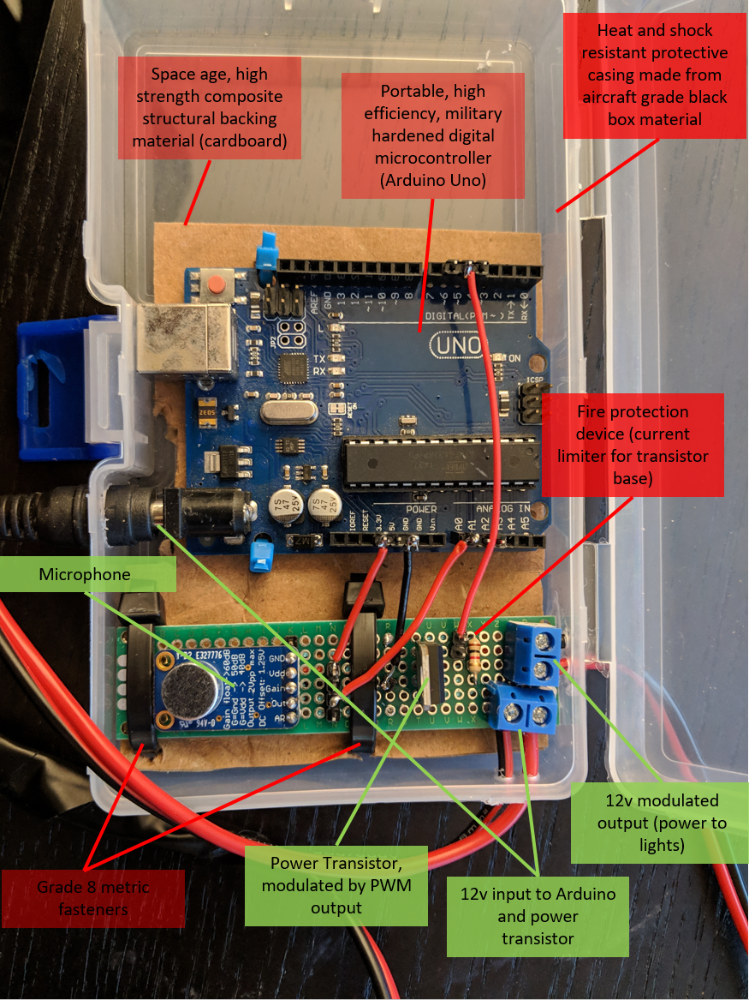

# Overview
An Arduino powered pulse width modulation (PWM) light controller, for making lights flash with music (or any dynamic sound source) in real time. Amplitude driven, no FFT magic here.
Turn any boring old party into a fantastic light show! You’ll be the talk of the neighborhood! Tested on LEDs and 12" cold cathode lamps, the latter of which produce a very interesting effect when hacked to work at less than 100% power.

# Secret Formula
Powering lights with an Arduino, even making them flash, is trivial. Making them flash in real time, responsively, to music of varying tempo and volume, pleasantly, is not! Two main problems had to be solved:
1. Amplitude correction: music volume is dynamic. And if you don’t take this into account, you’ll likely end up with lights that stay solidly on during loud parts and solidly off during quiet parts – not very exciting! The solution?

2. Output Brightness Correction: 

A naïve implementation (ask me how I know), adjusting pulse width linearly with mic voltage, causes lights to appear only to flash on and off, with very little range in between. I speculate that the human eye perceives light intensity logarithmically, much in the same way that human hearing is best measured on the logarithmic decibel scale. The solution: map the linear microphone voltage input to an inverse logarithmic function to linearize perception of LED brightness. Here's the relevent code from math_.cpp:

'''float correction(float rawValue)
{
	//remaps 0-100 to a function on 0-255 to correct for perception of brightness
	return exp(.055452*rawValue) - 1;
}'''

The result works quite well with the parameters in the code!

English, without a necessary correction, directly coupling sound intensity to LED brightness makes for lights that seem to flash on and off with very little dimming in between. 

# Hardware

* Arduino Uno: This part isn’t terribly important, this code should work just fine with any Arduino variant/clone
* Electret Microphone Amplifier: these somewhat crappy but rather nifty microphones come with adjustable gain and attack/release ratios. I think after playing around I settled on the default values.
* Power Transistor: I used a TIP122 NPN darlington transistor. Probably overkill at 65 watt capacity, but cheap and available.
* 12V power both the Arduino and the lights. I made my own nifty splitter so that I could use a single power supply.

# Implementation Details
Making the lights flash pleasantly and responsively required a number of 

Label base collector emiter

# Disclaimer
I am a lowly geophysicist, not an electrical engineer. If my spherical cow burns up whatever you're powering with it or explodes in your face, please don't sue me. Use at your own risk. Probably not safe for controlling medical devices or any kind.

# Licensing
I haven't found a particular license that fits my requirements. Until I do, this software is released more or less as open source for NON COMMERCIAL USE ONLY. If you want to sell it, I’d like a cut.
